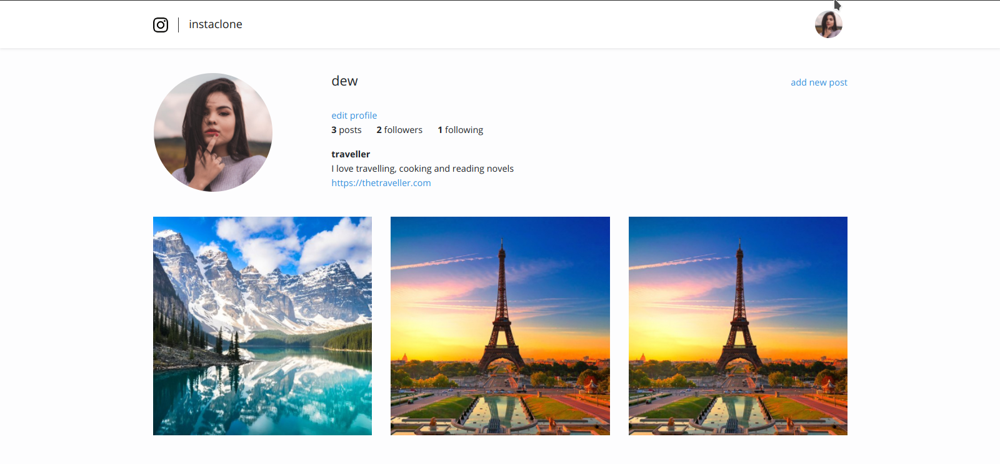

## About Instaclone
Its clone of some functionalities of instagram done in laravel free for anyone to use and improve,
written in blade.php and .vue on the frontendand php laravel framework backend

## What it does

-   Add Users and Authenicate them
-   _Auth_ user can add posts also the user can edit profile and follow other profiles
-   Any auth user can view profile of another user and their posts with its captions
-   Home page contain post from the user the auth user follows but they are none following user all the post are display from the latest
-   also sends welcome emails
-   look to add more functionality in the future

## How to use Instaclone

-  clone the repository from **[instaclone](https://github.com/edcheyjr/instaclone.git)**
-  Ensure your have install composer **[composer download](https://getcomposer.org/download/)** Then write `composer install` on your terminal after navigating to the directory with the pulled repository
-   copy content from `env.example` to `.env` created at the root directory
    the file should look like this

```
   APP_NAME=Laravel
   APP_ENV=local
   APP_KEY=
   APP_DEBUG=true
   APP_URL=http://localhost

   LOG_CHANNEL=stack
   LOG_LEVEL=debug

   DB_CONNECTION=mysql
   DB_HOST=127.0.0.1
   DB_PORT=3306
   DB_DATABASE=instaclone2
   DB_USERNAME=root
   DB_PASSWORD=

   BROADCAST_DRIVER=log
   CACHE_DRIVER=file
   QUEUE_CONNECTION=sync
   SESSION_DRIVER=file
   SESSION_LIFETIME=120

   REDIS_HOST=127.0.0.1
   REDIS_PASSWORD=null
   REDIS_PORT=6379

   MAIL_MAILER=smtp
   MAIL_HOST=smtp.mailtrap.io
   MAIL_PORT=2525
   MAIL_USERNAME=null
   MAIL_PASSWORD=null
   MAIL_ENCRYPTION=null
   MAIL_FROM_ADDRESS=null
   MAIL_FROM_NAME="${APP_NAME}"

   AWS_ACCESS_KEY_ID=
   AWS_SECRET_ACCESS_KEY=
   AWS_DEFAULT_REGION=us-east-1
   AWS_BUCKET=

   PUSHER_APP_ID=
   PUSHER_APP_KEY=
   PUSHER_APP_SECRET=
   PUSHER_APP_CLUSTER=mt1

   MIX_PUSHER_APP_KEY="${PUSHER_APP_KEY}"
   MIX_PUSHER_APP_CLUSTER="${PUSHER_APP_CLUSTER}"
```

-   Change you **DB_CONNECTION** to look like this in order to use sqlite database `DB_CONNECTION=sqlite` and delete all the other starting with `DB`
-   Alternatively, make neccessary adjustment if using another sql variant you like ,by default it comes as mysql configured as show below:
    `DB_CONNECTION=mysql DB_HOST=127.0.0.1 DB_PORT=3306 DB_DATABASE=laravel DB_USERNAME=root DB_PASSWORD=`
    Generate your **APP_KEY** by typing this on your terminal `php artisan key:generate`
    Add your **AWS_ACCESS_KEY_ID** and all the other required keys fore your use

Once configured

-   run `php artisan serve` on your project directory on the terminal to start the development serve
-   you can also run `npm run watch` on your project to watch for changes on your frontend alternative `npm run dev`
    to scaffold you frontend every time you make changes to your frontend
-   you can now test the apps functionality

## The web app

#### login


#### register


#### home


#### dashboard
**logged in person dashboard**


**other peoples dashboard**



#### edit page


#### photo  page


#### post page


## Where to Learn Laravel

Laravel has the most extensive and thorough [documentation](https://laravel.com/docs) and video tutorial library of all modern web application frameworks, making it a breeze to get started with the framework.

If you don't feel like reading, [Laracasts](https://laracasts.com) can help. Laracasts contains over 1500 video tutorials on a range of topics including Laravel, modern PHP, unit testing, and JavaScript. Boost your skills by digging into our comprehensive video library.
